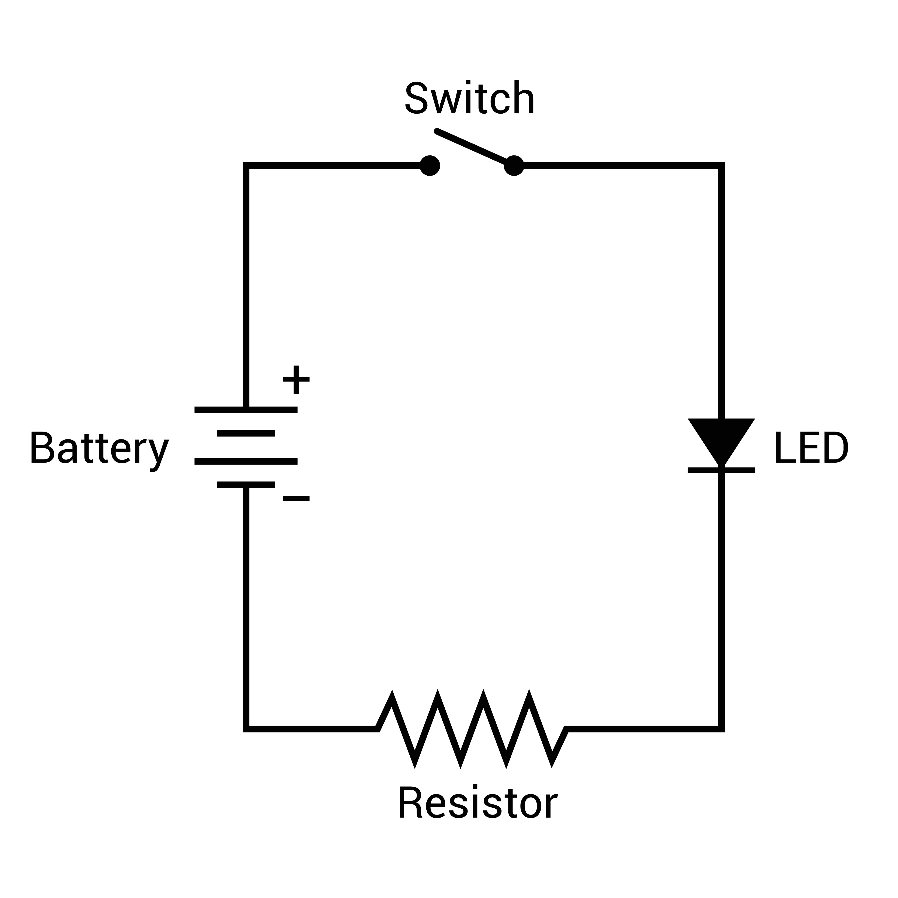

Computer hardware is not a "magic box." Behind sophisticated processors and fast RAM, fundamental principles of Electronics are at work. Studying hardware without understanding electronics is like trying to write poetry without knowing the alphabet; you might be able to memorize the patterns, but you will never understand why that structure exists.

---

## Where It All Begins

Everything you touch on a computer—from the casing to the smallest chip—is composed of Atoms. Before we can process data, we must understand the most basic particles that build this universe.

***Atomic Structure***

Imagine an atom as a miniature solar system. Inside, there are three main actors:

* Proton: Located in the nucleus (center). It has a Positive (+) charge. Protons are the identity of an object (e.g., the number of protons determines whether an object is gold or copper).
* Neutron: Located in the nucleus with protons. It has a Neutral charge. It functions as "glue" so that the nucleus remains stable.
* Electron: An extremely light particle with a Negative (-) charge. Electrons constantly move around the nucleus in specific paths or "shells."

Valence Electrons: The Key to Electronics

Electrons in the outermost path are called Valence Electrons. Because they are located furthest from the nucleus, the nucleus's pull on them is the weakest. This makes valence electrons very easy to "break away" and move to neighboring atoms if given a slight push of energy.

The movement of these valence electrons is what we call Electricity. Without the ability of electrons to move, we would never have electrical flow.

---

## Understanding the Nature of Electricity

In the world of electronics, there are three inseparable elements. They are Voltage, Current, and Resistance. These three are part of a unified system. You cannot discuss one without involving the other two. Let's discuss each one in depth.

### 1. Voltage

Everything starts with Voltage. People often ask, "What is a Volt?" Simply put, Voltage is pressure or a push. However, if we look deeper at the atomic level, Voltage is actually a potential difference.

Imagine a very high water dam. At the top of the dam, water piles up extensively and has immense pressure to break through to the bottom. Meanwhile, at the bottom of the dam, the water is calm. The difference in height between the water at the top and the bottom is what creates the pressure. In electricity, this is similar to a Battery. The Negative (-) terminal of a battery is packed full of electrons wanting to get out, while the Positive (+) terminal is empty. This imbalance creates the "push" or the desire for electrons to move. The greater the difference in content (higher Voltage), the stronger the push for electrons to jump. Without Voltage (this potential difference), electrons will be lazy and stay still.

### 2. Current

If Voltage is the "push," then Current is the event. Current is the actual occurrence when electrons truly flow from one point to another. We measure it in Amperes.

Imagine the previously mentioned dam's gates are opened. The water that was only pressing against the gate now gushes out forcefully. The flowing gush of water is what is called Current. In a copper wire, Current is billions of electrons lining up and running through the wire. It is important to remember: Voltage can exist without Current (like a battery stored in a drawer, it has voltage but no current because it isn't connected to anything). However, Current will never exist without Voltage. Current is the effect, and Voltage is the cause. The more electrons that flow per second, the larger the Ampere value.

### 3. Resistance: The Controller

The third pillar is Resistance. In this universe, no material lets electrons pass through 100% smoothly without interference (except superconductors at extreme temperatures). Every material must have the property of "rejecting" or hindering the flow of electrons. This property is called Resistance, measured in Ohms.

Imagine the water rushing from the dam has to pass through a pipe filled with pebbles and debris. The water will surely slow down, collide with the rocks, and its flow will become obstructed. In a wire, these "rocks" are the atoms that make up the wire itself. As electrons flow, they collide with these atoms. These collisions cause friction, and this friction hinders the flow of current. Resistance is vital. Without resistance, current would flow uncontrollably (like a flood) and destroy everything. We need resistance to control how much current is allowed to pass.

---

## Current Dynamics – Between Waves and Straight Lines

After understanding voltage, current, and resistance, we must face the fact that not all electricity is created equal. In this world, there are two major regimes of electrical flow that behave oppositely: **Alternating Current (AC)** and **Direct Current (DC)**. Understanding this difference is vital because a mistake in distinguishing them can be fatal—like trying to fill a car's gas tank with water.

### 1. Alternating Current (AC)

The electricity coming out of your home's wall outlet is AC or Alternating Current. As the name suggests, this current does not flow straight to a single destination. Electrons inside an AC wire move forward, then backward, then forward again, and backward again repeatedly. Imagine the motion of a saw being pulled back and forth while cutting wood; energy is delivered, but the saw remains in the same general area.

Why does the power grid use AC? Because this type of current is very efficient for "throwing" over hundreds of kilometers from power plants to your city without losing much power. However, this current has frequency characteristics. In Indonesia, our standard is **50Hz (Hertz)**. This means that in one second, the electrons in your home wiring change direction back and forth 50 times. If drawn in a graph, AC voltage looks like a wave that continuously goes up and down. Rising to a positive peak, then falling through zero, down to a negative trough.

### 2. Direct Current (DC)

On the other hand, we have DC or Direct Current. This is the type of electricity stored in batteries, accumulators, and—most importantly—this is the only type of electricity that digital devices can consume. In DC current, electrons flow disciplined in only one direction: from the positive terminal toward the negative terminal without ever reversing direction.

Imagine a calm river flowing constantly toward the mouth. There are no up and down waves, no backward movement. If drawn in a graph, DC is a flat and stable straight line. This stability is what computer components seek. Processor chips require "still" voltage (e.g., exactly 1.2 Volts continuously) so they can perform precise mathematical calculations. They cannot work with AC voltage that fluctuates because when the AC voltage touches the zero point (when reversing direction), the chip will lose power and momentarily shut down.

---

## Circuit Anatomy

After understanding the "soul" of electricity at the atomic level, it is time to descend into the physical world to meet the "body" of electronic devices. The computer hardware you see is not a single, magical object; it is an ecosystem built from thousands of small components working in harmony. Generally, all components in the world are divided into two main castes that complement each other: **Passive Components** and **Active Components**.

### Understanding the Caste Difference: Passive vs. Active

Before moving further, we must understand the fundamental difference between these two castes through an analogy of an irrigation system in a large plantation. Passive Components are like the pipes, manual faucets, and water storage tanks. They cannot increase the volume of water and do not need electricity to work; they simply "accept their fate" by obstructing, storing, or directing the existing flow. However, without their role, water would flow wildly and destroy the entire system.

On the other hand, Active Components are like electric pumps or sensor-based valves. They require an additional power source to function, but they possess an extraordinary ability: they can intelligently control the flow and amplify weak signals into strong ones. These Active Components are what eventually become the "brain" inside a computer chip. However, in this section, our primary focus is to delve into Passive Components. They are the foundation of stability; if active components are the "brain" that thinks, then passive components are the "blood vessels" that ensure the energy flow remains calm, measured, and safe. Let’s break down the three main pillars: Resistors, Capacitors, and Inductors.

### 1. The Resistor: The Gatekeeper of Flow

The resistor is the simplest yet most courageous component in a circuit. Its primary task is to "restrain itself" for the safety of other components. Its operation is based on the principle of resistance, where the resistor intentionally narrows the path of electrons and converts some of that excess electrical energy into heat. By slowing the flow of electrons, the resistor ensures that sensitive components ahead of it, such as LED lights or memory chips, do not receive an excessive current that could be fatal or cause them to burn out.

The primary function of a resistor goes beyond mere obstruction. It acts as a highly accurate voltage divider, allowing us to cut the voltage value from the main source to match the specific needs of every other small component. Without the presence of resistors, we would have no control over how much current is allowed to pass, making every circuit we build a constant risk for dangerous short circuits.

> **Reference:** Learn more about [Resistor Components on Wikipedia](https://en.wikipedia.org/wiki/resistor).

### 2. The Capacitor: The Voltage Reservoir

If a resistor's job is to obstruct, the Capacitor’s job is to save energy. Physically, it consists of two metal plates facing each other but separated by an insulating layer called a dielectric. This unique structure allows it to trap electrons on one side and store them in the form of a temporary electric field. Think of a capacitor as a backup water tank in your house; when the water flow is abundant, it fills itself to the brim, but when the main water supply suddenly flickers or drops, the capacitor immediately releases its stored energy so that the flow within the circuit remains stable without interruption.

In the computer ecosystem, the capacitor's function is crucial for "smoothing" or stabilization. Electricity coming from a wall outlet or a battery is often unstable and has small "ripples" that can interfere with the performance of digital chips. The capacitor acts as a shock absorber that smooths out these ripples so the voltage remains flat. Additionally, capacitors function as frequency filters capable of separating important data signals from unwanted electrical noise, ensuring that the information processed by the computer remains clean and accurate.

> **Reference:** Learn more about [Capacitor Components on Wikipedia](https://en.wikipedia.org/wiki/kapasitor).

### 3. The Inductor: The Balancer of Magnetic Flow

The inductor is the most unique component because it operates using the power of magnetic fields. Physically, it is simply a coil of copper wire, yet this coil possesses a powerful "anti-change" property. An inductor does not store energy in the form of voltage pressure like a capacitor, but rather in the form of a magnetic field created when current flows through it. The best analogy for understanding an inductor is a heavy flywheel; it takes extra effort to start spinning because it resists the change from rest to motion, but once it is spinning fast, it is very difficult to stop because it possesses magnetic momentum.

This behavior makes the inductor a highly reliable flow balancer. If there is a sudden spike in electrical current, the inductor will restrain it by turning it into a magnetic field so that the circuit ahead is not "shocked." Conversely, if the current suddenly disappears, the magnetic field will collapse and turn back into electricity to maintain the flow for a few milliseconds. This function is vital in protecting devices from electrical surges and serves as a core component in communication technologies like radio antennas and wireless charging systems.

> **Reference:** Learn more about [Inductor Components on Wikipedia](https://en.wikipedia.org/wiki/induktor).

---

## Practical Simulation – Powering Your First Circuit

After understanding "who" is moving (electrons) and "how" to measure them, we will now see how they work together in a circuit. This LED light circuit is the simplest miniature of how a computer works.

### List of Components and Their Roles

Let's break down each "team member" we will use:

* **Battery (Energy Source):** Like a heart or a Power Supply (PSU). It provides **Voltage (Volts)**. Without a battery, electrons inside the wire would just stay still. The battery provides the pressure for electrons to run.
* **Wire (Conductor):** Like a highway. Made of copper which is rich in **Valence Electrons**. The wire serves to connect all components so electrons have an uninterrupted circulation path.
* **Resistor (Resistance):** Like a traffic policeman or a water faucet. It provides **Resistance (Ohms)**. Its task is vital: ensuring the flowing current is not too heavy so that other components do not burn out.
* **LED (Load/Output):** Like a monitor or processor. An LED is a component that converts electrical energy into light. However, it is very delicate; if given too much current, it will burn out immediately.
* **Switch (Controller):** Like a power button. It functions as a breaker or connector for the path. Inside a computer CPU, these switches are microscopic and are called **Transistors**.

---

### Circuit Workflow

Let's observe what happens at the atomic level when this circuit is operated:

**1. Switch Open Condition (OFF):**
Even though the battery has pressure (Volts), current cannot flow because the wire path is broken. Electrons are held at the end of the switch. In the digital world, this "no flow" condition is called **Logic 0**.

**2. Switch Closed Condition (ON):**
When the switch is pressed, the path becomes perfectly connected (*Closed Circuit*). Pressure from the battery begins to push free electrons to move across the wire. This "flow exists" condition is called **Logic 1**.

**3. The Lifesaving Role of the Resistor:**
Electrons running fast from the battery do not go directly into the LED. They must pass through the Resistor first. The Resistor hinders their pace, reducing their speed, so the number of electrons reaching the LED is just right and safe.

**4. Light is Created:**
The electrons that have slowed down enter the LED, triggering a reaction that produces light, then exit back toward the negative terminal of the battery to repeat their journey.

---
