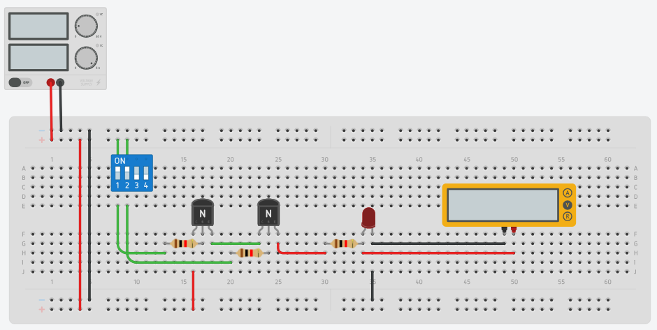
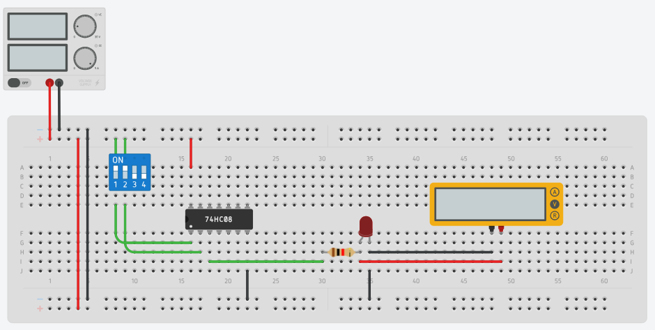
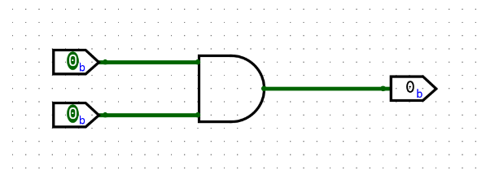

**Gerbang Logika** (*Logic Gate*) adalah blok bangunan dasar dalam sistem elektronika digital. Fungsinya adalah mengambil keputusan berdasarkan aturan logika tertentu dengan memproses satu atau lebih sinyal input menjadi satu sinyal output.

Bayangkan gerbang ini sebagai seorang **"satpam"** di sebuah pintu. Satpam ini memiliki instruksi khusus: kapan ia harus membuka pintu (Output 1 / HIGH) dan kapan harus menutup pintu (Output 0 / LOW) berdasarkan kondisi atau siapa yang datang ke pintu tersebut (Input).

---

## Gerbang AND

Gerbang AND hanya akan menghasilkan output **1 (HIGH)** jika **SEMUA** inputnya bernilai 1. Jika salah satu atau semua input bernilai 0, maka output akan menjadi **0 (LOW)**.

### Tabel Kebenaran Gerbang AND

| Input A | Input B | Output (Y) |
| :---: | :---: | :---: |
| 0 | 0 | **0** |
| 0 | 1 | **0** |
| 1 | 0 | **0** |
| 1 | 1 | **1** |

---

### Gerbang AND dengan Transistor

Pada praktikum ini, kita dapat membuat simulasi gerbang AND menggunakan dua buah **Transistor BJT NPN** yang disusun secara seri. Dalam susunan ini, arus hanya akan mengalir ke lampu (LED) jika kedua transistor dalam keadaan "ON" (menerima arus pada basisnya dari masing-masing saklar).

### Gerbang AND dengan IC 74HC08

IC 74HC08 adalah sirkuit terpadu (*Integrated Circuit*) yang berisi empat buah gerbang AND 2-input independen di dalam satu kemasan kecil (DIP-14). Menggunakan komponen IC merupakan cara yang jauh lebih praktis dan efisien dalam merangkai sirkuit digital dibandingkan menggunakan transistor secara terpisah.

### Gerbang AND dengan Logisim-evolution

Dalam perangkat lunak **Logisim-evolution**, simulasi gerbang AND sangat mudah dilakukan. Anda cukup menarik komponen gerbang AND dari panel *Gates*, lalu menyambungkan pin input ke komponen *Input (Pin)* dan pin output ke *Output (Pin)* atau komponen *LED*. Simulasi virtual ini sangat membantu untuk memverifikasi tabel kebenaran sebelum Anda merakit komponen asli di *breadboard*.

